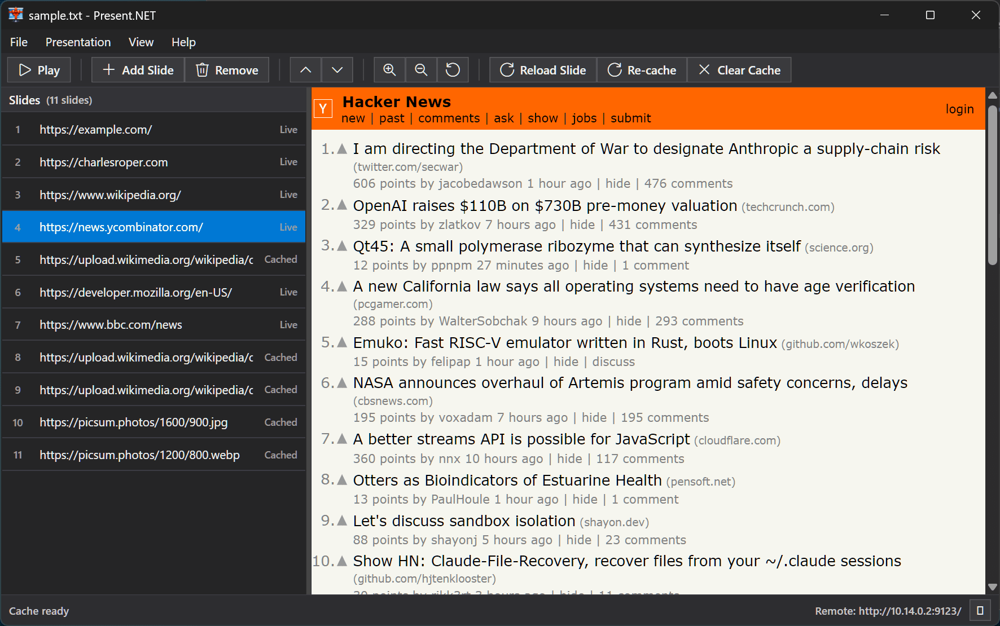

# Present.NET

[](https://github.com/charlesroper/Present.NET/actions)
[](https://github.com/charlesroper/Present.NET/releases)


[](https://github.com/charlesroper/Present.NET/blob/main/LICENSE)

A Windows .NET presentation app that displays web content and images as slides.

This is a vibe-coded port of Simon Willison's [dream macOS presentation app](https://simonwillison.net/2026/Feb/25/present/). It is entirely built in OpenCode, mostly using OpenAI GPT-5.3 Codex and MiniMax-M2.5 Free models. I have never opened the project in Visual Studio.

For contributor/agent workflow guidance, see `AGENTS.md`.



## Features

- **Edit Mode**: Left sidebar with slide URL list (numbered, drag-to-reorder); right pane WebView2 preview of the selected slide
- **Play Mode**: Fullscreen presentation window with black background, WebView2 content, slide counter overlay, arrow key navigation (wraps around), Escape to exit
- **Auto-persist**: Slide list is saved automatically and restored on relaunch (`%APPDATA%\Present.NET\slides.txt`)
- **File I/O**: Open/Save slide lists as plain text files (one URL per line)
- **Zoom Controls**: `Ctrl+=` / `Ctrl+-` / `Ctrl+0` to zoom in/out/reset (applies to both preview and fullscreen)
- **Theme Modes**: `View -> Theme` supports `Use System`, `Light`, and `Dark` for app UI chrome; preference is saved across launches
- **Image Slides**: URLs ending in `.png`, `.gif`, `.jpg`, `.jpeg`, `.webp`, `.svg` are rendered as full-window images on a black background
- **Slide Cache**: Slides are cached on load for faster navigation; toolbar actions support clear, re-cache, and reload of the selected slide
- **Remote Control Server**: Embedded HTTP server on port 9123 with a mobile-friendly HTML control page

## Requirements

- **Windows 10 / 11** (WPF is Windows-only)
- **.NET 8 SDK** — [Download](https://dotnet.microsoft.com/download/dotnet/8.0)
- **Microsoft Edge WebView2 Runtime** — Usually pre-installed on Windows 10/11. If not, [download here](https://developer.microsoft.com/en-us/microsoft-edge/webview2/)

## Quick Start (First Time with .NET)

If you are new to .NET, follow these steps exactly.

1. Install the **.NET 8 SDK**: https://dotnet.microsoft.com/download/dotnet/8.0
2. Open a terminal in this repository root (`Present.NET`).
3. Verify .NET is installed:

```powershell
dotnet --version
```

You should see a version that starts with `8.`.

4. Restore dependencies:

```powershell
dotnet restore
```

5. Build the app:

```powershell
dotnet build Present.NET.sln -c Release
```

6. Run the app:

```powershell
dotnet run --project src/Present.NET/Present.NET.csproj
```

## Build and Run (Reference)

```powershell
# Clone and build
git clone https://github.com/charlesroper/Present.NET.git
cd Present.NET
dotnet restore
dotnet build Present.NET.sln -c Release
dotnet format Present.NET.sln

# Run
dotnet run --project src/Present.NET/Present.NET.csproj
```

Or open `Present.NET.sln` in Visual Studio 2022 and press F5.

## Publishing / Releases

Releases are automated via GitHub Actions. To create a release:

```powershell
git tag v1.0.0-beta1
git push --tags
```

This triggers the workflow to build a self-contained Windows exe, zip it, and create a GitHub Release.

See `.github/workflows/release.yml` and `AGENTS.md` for details.

## Testing

This repository includes automated tests in two projects:

- `tests/Present.NET.Tests` - unit and integration tests for core logic and services
- `tests/Present.NET.UiTests` - gated desktop UI smoke tests (FlaUI)

Run all tests:

```powershell
dotnet test Present.NET.sln
```

Run only unit/integration tests:

```powershell
dotnet test tests/Present.NET.Tests/Present.NET.Tests.csproj
```

Run UI smoke tests (opt-in):

```powershell
$env:PRESENT_UI_TESTS = "1"
dotnet test tests/Present.NET.UiTests/Present.NET.UiTests.csproj
```

If `PRESENT_UI_TESTS` is not set to `1`, UI smoke tests are skipped by design.

## TDD Workflow

Development follows red/green/refactor TDD:

1. Write a failing test first (red)
2. Implement the smallest change to pass (green)
3. Refactor with tests still passing (refactor)

Recent test-related changes in this repo were implemented as one commit per TDD slice to keep history explicit and auditable.

## Usage

### Edit Mode

1. Click **+ Add Slide** to add a new slide URL
2. Type or paste a URL into the text field (e.g. `https://example.com` or `https://example.com/image.png`)
3. Select a slide to preview it in the right pane
4. Drag slides up/down to reorder them
5. Use **↑/↓** toolbar buttons or drag-and-drop to reorder
6. Use **File → Open / Save / Save As** to manage slide list files
7. Use **View → Theme** to switch app UI between **Use System**, **Light**, and **Dark**

### Play Mode

Press **F5** or click **▶ Play** to start the presentation:

| Key | Action |
|-----|--------|
| `→` / `↓` / `Space` / `PgDn` | Next slide |
| `←` / `↑` / `PgUp` | Previous slide |
| `Ctrl+=` | Zoom in |
| `Ctrl+-` | Zoom out |
| `Ctrl+0` | Reset zoom |
| `F` | Toggle slide counter |
| `Esc` | Exit fullscreen |

Navigation wraps around (last slide → first, first slide → last).

### Image Slides

URLs ending in `.png`, `.gif`, `.jpg`, `.jpeg`, `.webp`, or `.svg` are automatically detected and rendered as full-window images on a black background, scaled to fit while preserving aspect ratio.

### Slide Cache

When you open a slide list, Present.NET starts caching images in the background.

- Selecting an image slide also triggers caching if it is not cached yet.
- **Reload Slide** purges and re-caches the selected slide.
- **Re-cache** clears and rebuilds cache for all slides.
- **Clear Cache** removes all cached slide content.
- Web pages are always "Live" — they are not cached because they are rendered directly from the network.

Cache status is shown next to each slide in the sidebar:

- **Cached** — image saved locally, loads instantly offline
- **Live** — web page loads from the internet each time
- **Failed** — image could not be cached (check URL and internet connection)

### Remote Control

An HTTP server runs on port 9123. Open `http://<your-ip>:9123/` on your phone or tablet for a mobile-friendly remote control page. The IP address is shown in the toolbar.
The remote server is hosted with Kestrel and does not require `netsh` URL ACL setup.

In the toolbar remote field:

- Click the copy icon to copy only the remote URL (for example `http://<your-ip>:9123/`)
- Double-click anywhere on the remote field to copy only the remote URL

#### Using Tailscale on restrictive Wi-Fi

If conference or guest Wi-Fi blocks device-to-device LAN traffic, use Tailscale for a more reliable remote connection.

- **What it is:** Tailscale gives your laptop and phone stable private IP addresses (typically `100.x.y.z`) on a shared tailnet.
- **Why use it:** It avoids local network quirks where `http://<lan-ip>:9123/` works on localhost but fails from another device.

Quick setup:

1. Install Tailscale on your laptop and phone.
2. Sign in on both devices with the same Tailscale account (same tailnet).
3. On your laptop, find the Tailscale IPv4 address in the Tailscale app.
4. On your phone, open `http://<tailscale-ip>:9123/`.

Example:

```text
http://100.101.102.103:9123/
```

**API Endpoints:**

| Endpoint | Description |
|----------|-------------|
| `GET /` | Mobile HTML remote control page |
| `GET /next` | Go to next slide |
| `GET /prev` | Go to previous slide |
| `GET /play` | Start fullscreen presentation |
| `GET /stop` | Stop presentation (close fullscreen) |
| `GET /zoomin` | Zoom in |
| `GET /zoomout` | Zoom out |
| `GET /scroll?dy=200` | Scroll page by `dy` pixels |
| `GET /status` | JSON status (`currentIndex`, `slideCount`, `isPlaying`, `currentUrl`, `zoomFactor`) |

All endpoints (except `/`) return a JSON status object.

### Keyboard Shortcuts (Edit Mode)

| Shortcut | Action |
|----------|--------|
| `F5` | Play presentation |
| `Ctrl+O` | Open file |
| `Ctrl+S` | Save file |
| `Ctrl+Shift+S` | Save As |
| `Ctrl+=` | Zoom in |
| `Ctrl+-` | Zoom out |
| `Ctrl+0` | Reset zoom |

## Project Structure

```
Present.NET/
├── Present.NET.sln
├── README.md
├── tests/
│   ├── Present.NET.Tests/
│   └── Present.NET.UiTests/
└── src/
    └── Present.NET/
        ├── Present.NET.csproj
        ├── App.xaml / App.xaml.cs
        ├── MainWindow.xaml / MainWindow.xaml.cs     ← Edit mode UI
        ├── FullscreenWindow.xaml / FullscreenWindow.xaml.cs  ← Play mode
        ├── Models/
        │   ├── SlideItem.cs       ← Data model for a slide
        │   └── SlideHelper.cs     ← URL detection & image HTML
        └── Services/
            ├── PersistenceService.cs    ← Save/load slide lists
            └── RemoteControlServer.cs   ← HTTP remote control server
```

## Slide List File Format

Slide lists are plain text files with one URL per line:

```
https://example.com/slide1
https://example.com/slide2.png
https://mypresentation.com/deck
```

Blank lines are ignored. The auto-save file is located at `%APPDATA%\Present.NET\slides.txt`.
